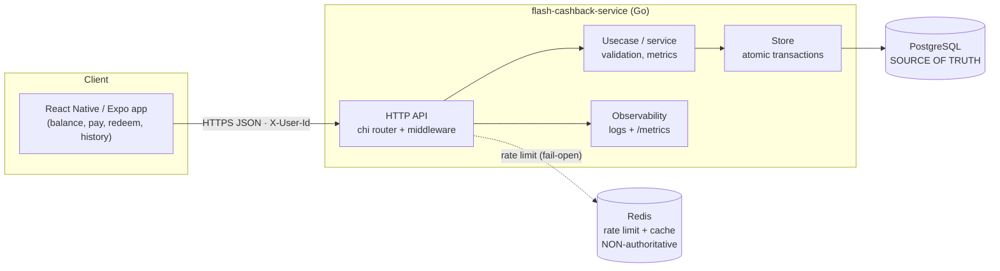
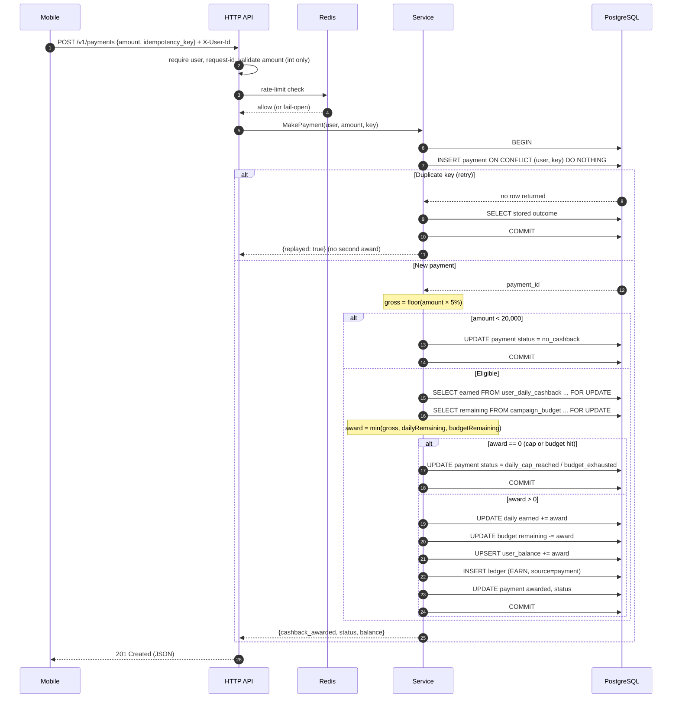
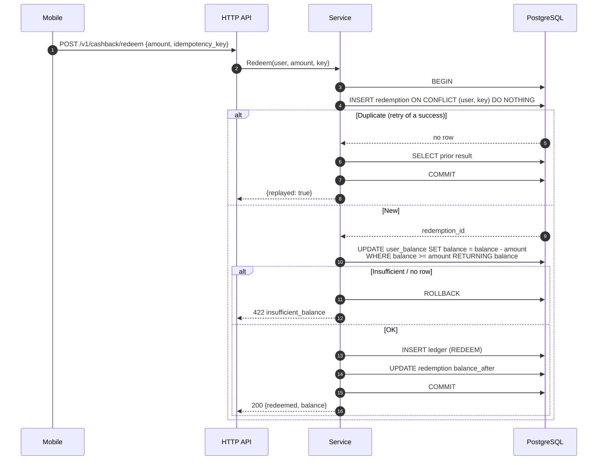
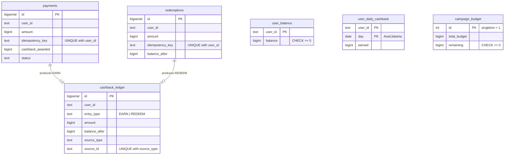
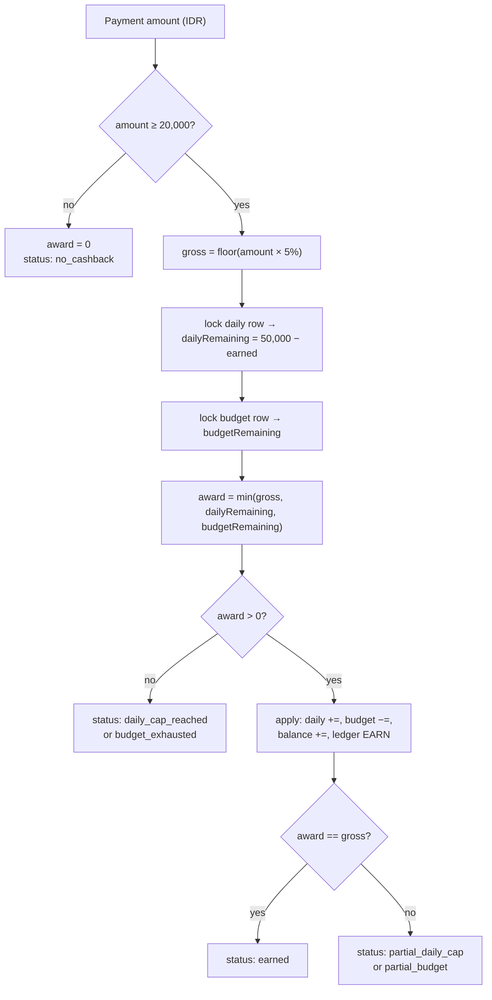
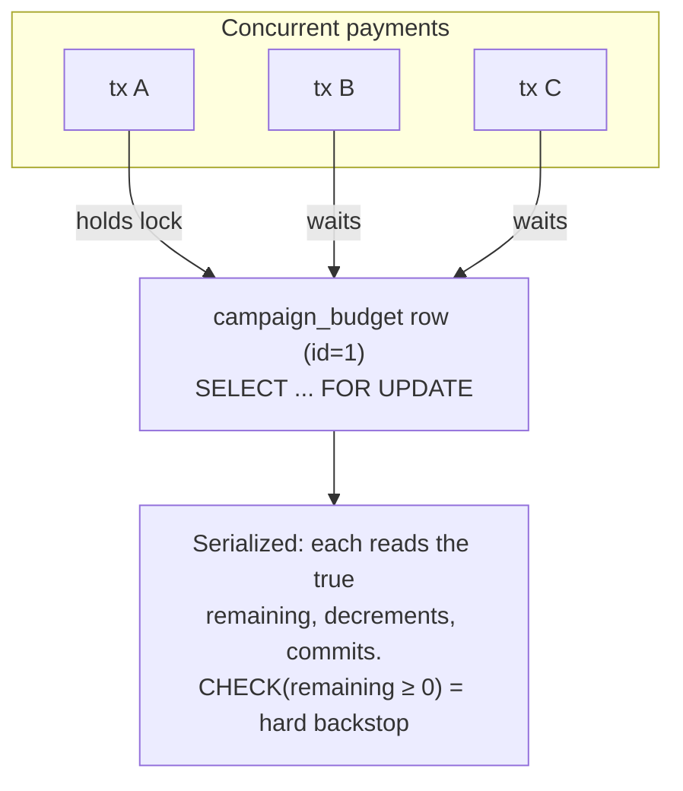

# Flash Cashback — Architecture & Design

A visual walk-through of the system, written to be presented in the technical
interview. GitHub renders every Mermaid diagram below inline. Each section ends
with **talking points** — the sentences you can actually say out loud.

---

## 1. System overview

**Talking points**
- Clean layering: `HTTP → usecase → store → Postgres`, with a pure `domain`
  package (rules only, no I/O) so the money logic is testable in isolation.
- **One hard rule: Postgres is the only source of truth for money.** Redis never
  decides money — it only rate-limits and caches, and it *fails open* so a Redis
  outage degrades throttling, never correctness.

---

## 2. Earn cashback — the money-critical path

This is the request to spend the most time on. Everything happens inside **one
Postgres transaction** so it is atomic and crash-safe.

**Talking points**
- **Idempotency first:** the very first statement tries to insert the payment on
  a unique `(user_id, idempotency_key)`. A retried request finds the conflict and
  returns the *original* outcome — a network retry can never pay cashback twice.
- **Two locks, deliberate order:** the per-user daily row is locked
  `FOR UPDATE`, then the single global budget row. Because the shared budget row
  is always taken *last*, no deadlock cycle can form.
- **Partial award:** `award = min(gross, dailyRemaining, budgetRemaining)` — we
  pay as much as still fits rather than all-or-nothing, so the budget lands
  exactly on 10,000,000.
- Balance, daily tally, budget, ledger, and payment status all move in the **same
  transaction** — all-or-nothing.

---

## 3. Redeem cashback

**Talking points**
- The debit is a **single guarded update** (`... WHERE balance >= amount`). It
  can't go negative, and the DB `CHECK (balance >= 0)` is a final backstop.
- A failed redeem **rolls back the whole transaction**, including the redemption
  row — so the idempotency key isn't "burned" and the user can retry after they
  earn more.

---

## 4. Data model

**Talking points**
- The **append-only ledger** is the backbone: every movement of money is one
  immutable row. `user_balance`, `user_daily_cashback`, and `campaign_budget` are
  *materialized counters* kept consistent with the ledger in the same tx — cheap
  reads and cheap hot-path checks, while the ledger stays auditable and
  reconcilable. Invariant proven by a test: `sum(ledger) == balance`.
- Idempotency is enforced twice: on the source tables (`user_id, key`) and on the
  ledger (`source_type, source_id`) — a payment/redemption yields **at most one**
  ledger entry.

---

## 5. Award decision logic

**Talking points**
- Money is **integer IDR only**; 5% uses integer math with **floor** rounding
  (conservative for the budget), and the API rejects fractional input outright.
- "Per day" = a calendar day in **Asia/Jakarta (WIB)** — a UTC boundary would
  reset the cap at 07:00 local. tzdata is embedded in the binary.

---

## 6. Concurrency model (why it can't overspend)

**Talking points**
- Every award serializes on the single budget row, so concurrent awards **cannot**
  jointly overspend. The same pattern (row lock) protects the per-user daily cap.
- This correctness guarantee **is** the throughput ceiling — it's the honest
  trade-off. At scale I'd shard the budget into N reservation buckets or use a
  reserve/commit pattern. Deliberately out of scope for the MVP, and called out.
- **This isn't asserted, it's proven:** integration tests fire 50–200 goroutines
  and check the daily cap is exactly 50,000, the budget lands exactly on its
  total (never negative), 100 concurrent redeems produce exactly 50 successes,
  and a payment sent 30× concurrently is awarded exactly once.

---

## 7. Failure modes & how the design holds up

| Scenario | What happens | Why it's safe |
|----------|--------------|---------------|
| Client retries a payment | Conflict on unique key → original result returned | No double award |
| Two payments race the daily cap | Serialize on locked daily row | Cap never exceeded |
| Many payments race the budget | Serialize on locked budget row | Budget never overspent |
| Concurrent redemptions | Guarded `WHERE balance >= amount` + row lock | Never negative |
| Process crashes mid-award | Uncommitted tx rolls back | No partial state |
| Redis is down | Rate limiter fails open | Money correctness unaffected |
| Bug tries to overspend | `CHECK (remaining >= 0)` / `CHECK (balance >= 0)` | DB refuses to persist it |

---

## 8. Deliberately out of scope (and why)

Refunds/clawback (ledger is built to support them later), authentication (identity
via `X-User-Id`, set by an auth gateway in prod), fraud/velocity checks, a sharded
budget counter, and an outbox for downstream events. Scope discipline is part of
the design — these are conscious cuts, documented, not gaps.
